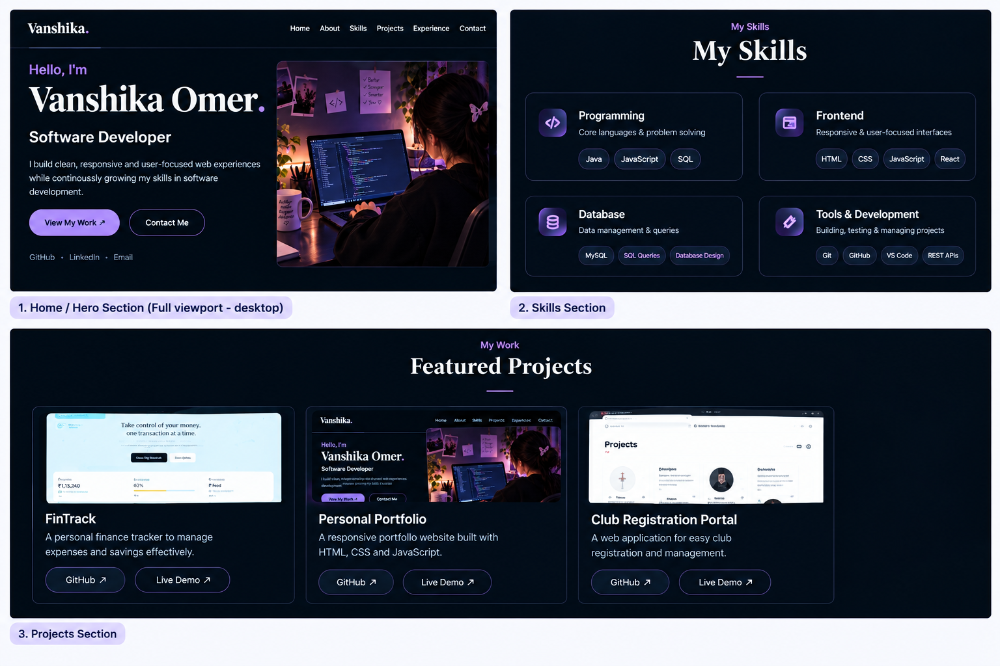

# Personal Portfolio Website

## 📌 Project Overview

This project is a responsive personal portfolio website designed to showcase my skills, projects, experience, resume, and contact information.

The website is built using **HTML5, CSS3, and JavaScript** with a focus on responsive design, accessibility, clean code, and modern web design principles.

## ✨ Features

* Responsive design for mobile, tablet, and desktop devices
* Semantic HTML5 structure
* Responsive navigation menu
* Hero, About, Skills, Projects, Experience, and Contact sections
* Project showcase with project descriptions
* Contact form with basic validation
* Resume download option
* Social media and GitHub links
* CSS hover effects and transitions
* Flexbox and CSS Grid layouts
* Accessible markup with alternative text for images
* Mobile-friendly layout
* Cross-browser compatible design

## 🛠️ Technologies Used

* **HTML5** — Website structure and semantic markup
* **CSS3** — Styling, layouts, animations, and responsive design
* **JavaScript** — Basic interactivity and navigation
* **Git & GitHub** — Version control and project hosting
* **GitHub Pages** — Website deployment
* **VS Code** — Development environment

## 📂 Project Structure

```text
portfolio-w/
│
├── index.html
├── style.css
├── script.js
├── resume_port.pdf
├── .gitignore
└── .vscode/
```

## 📱 Responsive Design

The website is designed to adapt to different screen sizes.

Responsive layouts and media queries are used to provide a consistent experience across:

* 📱 Mobile devices
* 📱 Tablets
* 💻 Laptops
* 🖥️ Desktop screens

The navigation, project cards, sections, and other elements adjust according to the available screen size.

## ♿ Accessibility

Accessibility considerations implemented in the project include:

* Semantic HTML5 elements
* Descriptive `alt` attributes for images
* Proper heading hierarchy
* Accessible navigation links
* Form labels and input types
* Keyboard-friendly interactive elements
* Sufficiently clear visual structure

## 🧪 Testing

The website was tested for:

* Responsive layout on different screen sizes
* Navigation functionality
* Contact form input validation
* Button and link functionality
* Image loading
* Resume download functionality
* Mobile navigation
* General visual consistency

The website was also checked using browser developer tools to identify and resolve layout and styling issues.

## ⚙️ Setup Instructions

To run this project locally:

1. Clone the repository:

```bash
git clone https://github.com/06style/portfolio-w.git
```

2. Open the project folder:

```bash
cd portfolio-w
```

3. Open `index.html` in a web browser.

Alternatively, the project can be opened using the **Live Server extension in VS Code**.

## 🌐 Live Demo

**Portfolio Website:**
https://06style.github.io/portfolio-w/

## 📸 Screenshots

### 1. Home / Hero Section


### 2. Skills Section
The portfolio includes categorized skills covering programming, frontend development, databases, and development tools.

### 3. Projects Section
The projects section showcases FinTrack, Personal Portfolio, and Club Registration Portal with project details and links.

## 💡 Technical Details

The project uses semantic HTML5 elements such as:

* `<header>`
* `<nav>`
* `<main>`
* `<section>`
* `<footer>`

CSS **Flexbox and Grid** are used to create structured layouts, while **media queries** are used to make the website responsive.

JavaScript
